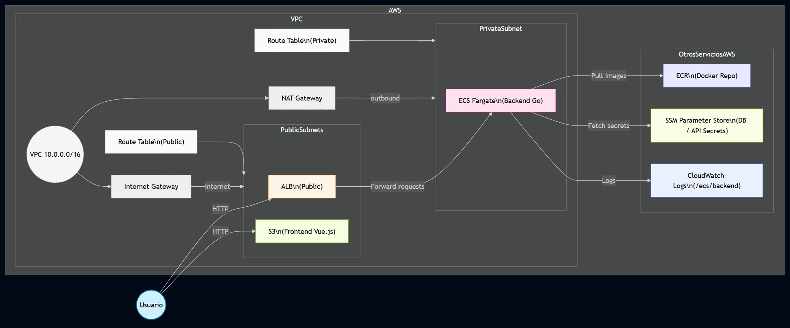

## stock-advisor-terraform

This repository contains the Infrastructure as Code (IaC) configuration for the **Stock Advisor** project, deployed on AWS using **Terraform**. The main goal is to securely and scalably host both the Go-based API (backend) and the Vue.js application (frontend). AWS services such as ECS Fargate, ALB, S3, and Parameter Store are utilized to manage an external CockroachDB database.

### Architecture Diagram



This diagram illustrates the high-level architecture of the **Stock Advisor** project, showcasing the integration of AWS services such as ECS Fargate, ALB, S3, and Parameter Store with an external CockroachDB database.
---

### Directory Structure

```
stock-advisor-terraform/
├── environments/
│   └── develop/
│       ├── certs/
│       │   └── ca_cert.pem (gitignore)
│       ├── main.tf
│       ├── outputs.tf
│       ├── terraform.tfvars (gitignore)
│       └── variables.tf
└── modules/
    ├── backend/
    │   ├── ecr.tf
    │   ├── ecs_cluster.tf
    │   ├── ecs_service.tf
    │   ├── load_balancer.tf
    │   ├── outputs.tf
    │   ├── task_definition.tf
    │   └── variables.tf
    ├── database/
    │   ├── main.tf
    │   ├── outputs.tf
    │   └── variables.tf
    ├── frontend/
    │   ├── main.tf
    │   ├── outputs.tf
    │   └── variables.tf
    ├── networking/
    │   ├── main.tf
    │   ├── outputs.tf
    │   └── variables.tf
    └── security/
        ├── main.tf
        ├── outputs.tf
        └── variables.tf
```

**`environments/develop`**  
- **certs**: Holds the CockroachDB CA certificate (`ca_cert.pem`). Ignored by Git for security.  
- **main.tf**: Main file invoking the different modules (networking, security, backend, etc.).  
- **outputs.tf**: Exposes outputs from each module (URLs, ARNs, etc.).  
- **terraform.tfvars**: Contains environment-specific or sensitive values (ignored by Git).  
- **variables.tf**: Declares the variables used in this environment (e.g., AWS credentials, region).

**`modules`**  
Each folder is a reusable module for different cloud components:

- **backend**: Deploys the Go-based API:
  - ECR for Docker images
  - ECS Cluster & Task Definition on Fargate
  - ECS Service with an ALB for traffic routing
- **database**: Manages CockroachDB connection setup via AWS SSM Parameter Store.
- **frontend**: Hosts the Vue.js app in an S3 static website bucket.
- **networking**: Creates and configures the AWS VPC, subnets (public/private), NAT Gateway, etc.
- **security**: Sets up IAM roles/policies and security groups for restricted access.

---

### Requirements

- **Terraform** v1.11.3 or later  
- **AWS CLI** configured with valid credentials  
- Permissions to create resources in AWS

> Note: This setup has been tested with newer Terraform releases (v1.2+). It should work on v1.11.3, but consider upgrading if any compatibility issues arise.

---

### Usage

1. **Clone the repository:**
   ```bash
   git clone https://github.com/your-username/stock-advisor-terraform.git
   ```

2. **Navigate to the environment folder (e.g., `develop`):**
   ```bash
   cd stock-advisor-terraform/environments/develop
   ```

3. **Initialize Terraform:**
   ```bash
   terraform init
   ```

4. **Review the plan:**
   ```bash
   terraform plan
   ```

5. **Apply the changes:**
   ```bash
   terraform apply
   ```
   Type `yes` when prompted.

6. **Destroy the infrastructure (optional):**
   ```bash
   terraform destroy
   ```
   Make sure to back up or remove important data beforehand.

---

### Notes

- The `terraform.tfvars` file (ignored by `.gitignore`) should contain sensitive values (e.g., `aws_access_key`, `aws_secret_key`) and the CockroachDB connection string.  
- The `ca_cert.pem` file is excluded from version control for security.  
- To build and push Docker images to ECR, you need the AWS CLI (e.g. `aws ecr get-login-password`) and Docker installed.

---

### Future Improvements

- Configure **HTTPS** on the ALB using an ACM certificate.  
- Add **CloudFront** to deliver the frontend more securely and efficiently.  
- Implement **Auto Scaling** for ECS tasks in production.  
- Integrate a **CI/CD pipeline** (AWS CodePipeline, GitHub Actions, etc.) for automated deployments.
